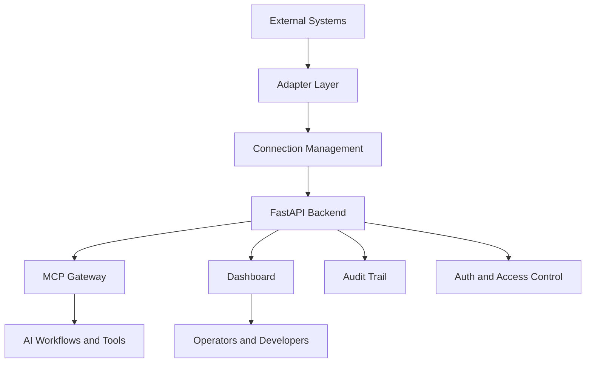
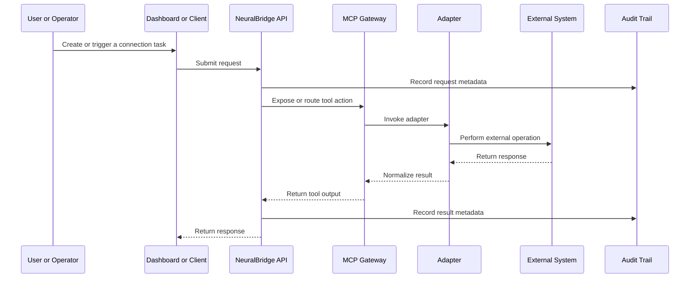
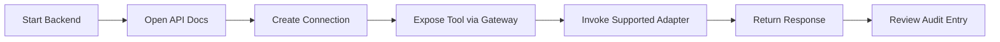
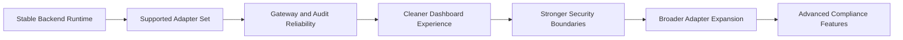

# NeuralBridge

<p align="center">
  <strong>A lightweight integration hub for AI workflows and external systems.</strong>
</p>

<p align="center">
  <a href="https://github.com/iceccarelli/neuralbridge/actions/workflows/ci.yml"></a>
  <a href="https://opensource.org/licenses/MIT"></a>
</p>

**NeuralBridge** is an open-source backend and integration layer for connecting AI-driven workflows to external systems through a smaller, more manageable set of services. It is being shaped around a simple idea: make it easier to expose useful tools, connections, and system actions through a consistent API and gateway layer without pretending that every enterprise integration problem is already solved.

At this stage, NeuralBridge should be understood as a **working foundation** rather than a finished universal middleware platform. The immediate focus is on building a reliable default path: a backend that starts cleanly, a dashboard that is understandable, a connection model that is easy to work with, an MCP-facing gateway, a basic audit trail, and a limited set of adapters that are truly supported.

## What NeuralBridge Currently Focuses On

The project is intentionally being narrowed so that users can clone it, understand it, run it, and extend it with confidence.

| Area | Current Focus |
|---|---|
| **Backend API** | A FastAPI service for connections, management, and tool exposure |
| **Integration Layer** | A small set of adapter-driven connection patterns |
| **MCP Gateway** | A common access layer for tool listing and invocation |
| **Dashboard** | A basic UI for managing and understanding connections |
| **Auditability** | A practical audit trail for system actions |
| **Security Foundations** | Authentication and authorization building blocks that are being tightened over time |

## What NeuralBridge Is Not Claiming Yet

NeuralBridge is **not** currently presented as a complete enterprise-ready universal middleware for every system, every compliance requirement, or every security model. The repository already contains work toward a broader future, including many adapter modules, compliance-oriented components, and security abstractions. However, those areas should currently be understood as **evolving**, **partial**, or **planned**, unless they are part of the documented supported workflow.

This README therefore focuses on the smaller product that the repository can grow into honestly.

## Current Supported Scope

| Capability | Current Status |
|---|---|
| FastAPI backend | **Supported** |
| Connection management model | **Supported as a core direction** |
| MCP tool listing / invocation layer | **Supported** |
| Dashboard foundation | **Supported** |
| Basic audit trail | **Supported as a practical foundation** |
| Small set of working adapters | **Intended supported scope** |
| Broad adapter ecosystem | **Experimental / evolving** |
| Full enterprise compliance posture | **Not part of the core promise yet** |
| Full zero-trust posture | **Not part of the core promise yet** |
| Immutable enterprise-grade audit guarantees | **Not part of the core promise yet** |
| No-code enterprise deployment for any system | **Too broad for the current promise** |

## Product Direction

The most honest way to describe NeuralBridge today is this:

> NeuralBridge is a lightweight integration hub that helps AI workflows interact with external systems through a clean backend, a gateway layer, and a small set of supported adapters.

That is a narrower claim than the original vision, but it is a stronger foundation. The current priority is not maximum breadth. It is a smaller platform that can be run, tested, and understood end-to-end.

## Architecture Overview

The architecture is intentionally straightforward. External systems are connected through adapter logic, exposed through backend services, and surfaced to users or AI workflows through a gateway and dashboard.



This is the core mental model for the repository: adapters connect systems, the backend organizes them, the gateway exposes them, and the dashboard makes them easier to manage.

## Request Flow

The following flow shows the intended path for a typical system interaction.



This diagram is not meant to imply that every supported path is fully mature today. It is meant to show the intended operating model around which the current implementation is being simplified.

## Core Components

| Component | Purpose |
|---|---|
| `src/neuralbridge/api` | API routes and backend-facing service behavior |
| `src/neuralbridge/adapters` | Integration modules for external systems |
| `src/neuralbridge/core` | Gateway and orchestration-related logic |
| `src/neuralbridge/security` | Authentication, RBAC-related code, audit logic, and sandbox-related foundations |
| `src/neuralbridge/compliance` | Compliance-oriented utilities that are still evolving |
| `src/dashboard` | Frontend interface for managing and understanding connections |

## Adapter Strategy

NeuralBridge contains a broad set of adapter files, but the project is being repositioned around a **smaller supported subset**. That means the most useful short-term direction is to clearly distinguish what is **supported now** from what is **planned or experimental**.

### Supported-Now Philosophy

The project should aim to support a few adapters very well before claiming broad universal coverage. The most practical early candidates are:

| Adapter Type | Why it fits the reduced scope |
|---|---|
| **PostgreSQL** | High practical value and clear enterprise relevance |
| **REST API** | Broad usefulness and straightforward demonstration value |
| **Slack** or **Notion** | Helpful for visible end-to-end demos |

### Experimental or Future Areas

Other adapters may remain in the repository, but they should be described honestly as **experimental**, **in progress**, or **planned** until they are covered by clear setup instructions and repeatable tests.

## Installation

The recommended way to work with NeuralBridge right now is from source, in a clean virtual environment, with the backend and dashboard treated as explicit development components.

### Backend Setup

```bash
git clone https://github.com/iceccarelli/neuralbridge.git
cd neuralbridge
python -m venv .venv
source .venv/bin/activate
pip install -e ".[dev]"
```

### Dashboard Setup

If you want to work with the frontend, install the dashboard dependencies separately from within the dashboard directory according to the project’s frontend setup.

```bash
cd src/dashboard
pnpm install
```

The exact dashboard startup command should follow the frontend package configuration currently checked into the repository.

## Quick Start

The intended quick start for NeuralBridge is a small local workflow that proves the core system path.

### 1. Start the Backend

```bash
uvicorn neuralbridge.main:app --host 0.0.0.0 --port 8000 --reload
```

Then open:

```text
http://localhost:8000/docs
```

### 2. Start the Dashboard

Run the dashboard locally from `src/dashboard` using the project’s configured frontend development command.

### 3. Verify the Core Path

The most valuable first-run checks are the following:

| First Check | Why it matters |
|---|---|
| Open `/docs` | Confirms the backend starts |
| Create a connection object | Confirms the core backend model works |
| Use an MCP list call | Confirms the gateway path is alive |
| Run one supported adapter flow | Confirms an actual integration path works |
| Inspect audit output | Confirms actions are being recorded |

## Example Interaction Model

A minimal integration journey should look like this.



This is the user experience NeuralBridge should optimize for first.

## Configuration Philosophy

NeuralBridge is intended to be configuration-driven, but the current emphasis is on **clarity over breadth**. Configuration should be used to support the paths that are tested and documented, rather than to imply that every possible system can already be integrated safely and seamlessly.

In practical terms, that means:

| Principle | Why it matters |
|---|---|
| Keep defaults simple | Reduces failed first runs |
| Support only a few well-documented adapters first | Increases trust |
| Keep security behavior explicit | Prevents hidden assumptions |
| Prefer tested examples over broad claims | Makes the repository easier to use |

## Security and Audit Positioning

Security is important to the long-term direction of NeuralBridge, but the project should currently describe its capabilities with restraint. The repository includes authentication, RBAC-related code, audit logging, and other protective building blocks. The immediate goal is to make those parts **clear, reliable, and well-bounded** before presenting them as a complete enterprise-grade security platform.

The same applies to compliance-oriented modules. They are meaningful parts of the roadmap, but they should not dominate the current public promise until they are consistently demonstrated end-to-end.

## Project Structure

```text
neuralbridge/
├── src/neuralbridge/
│   ├── adapters/
│   ├── api/
│   ├── compliance/
│   ├── core/
│   ├── security/
│   └── utils/
├── src/dashboard/
├── tests/
├── docs/
├── examples/
└── scripts/
```

This structure reflects the main intent of the repository: backend services, adapters, gateway behavior, audit/security building blocks, and a usable UI layer.

## Testing

NeuralBridge includes a pytest-based backend test suite, and the most useful future work is to strengthen the tests around the actual core product path.

```bash
pytest tests/ -v --cov=src/neuralbridge --cov-report=term-missing
```

The most valuable tests for the reduced-scope version of the project are:

| Test Area | Why it matters |
|---|---|
| Backend startup | Ensures the project boots cleanly |
| Connection creation | Protects the basic workflow |
| Supported adapters | Proves real integration value |
| MCP tool listing and invocation | Proves the gateway path |
| Audit trail behavior | Proves system actions are traceable |
| Auth and access control | Protects the minimum secure boundary |

## Dashboard Role

The dashboard is a meaningful part of the developer and operator experience, but its role should stay grounded in the supported product scope.

Today, the dashboard is best understood as a way to:

| Dashboard Role | Meaning |
|---|---|
| Visualize available system functions | Help users understand the platform |
| Create and inspect connections | Support the core connection model |
| Manage supported integration paths | Focus attention on what actually works |
| Complement the API, not replace reality | Keep the UI aligned with the backend |

## Roadmap Direction

The long-term direction remains broader than the current public promise, but the order matters. NeuralBridge should first become a dependable small platform before it becomes a broad one.



This is the intended maturation path: stability first, then supported integrations, then broader capabilities.

## Contributing

Contributions are welcome, especially when they make the project more reliable, easier to install, easier to understand, and more aligned with the current supported scope. In the near term, the most useful contributions are the ones that improve the default backend path, tighten adapter contracts, improve tests, clarify documentation, and make the first-run experience more dependable.

Please see [CONTRIBUTING.md](CONTRIBUTING.md) for contribution guidance.

## Security

If you discover a security issue, please refer to [SECURITY.md](SECURITY.md). Security work is especially valuable when it improves authentication behavior, access control boundaries, configuration hygiene, audit consistency, and the safety of the supported default workflow.

## License

NeuralBridge is licensed under the [MIT License](LICENSE).

## Closing Note

NeuralBridge has a broader long-term ambition, but this README is intentionally grounded in what the project should responsibly promise now. The goal is to build something smaller, clearer, and genuinely useful first, and then expand it carefully over time.
